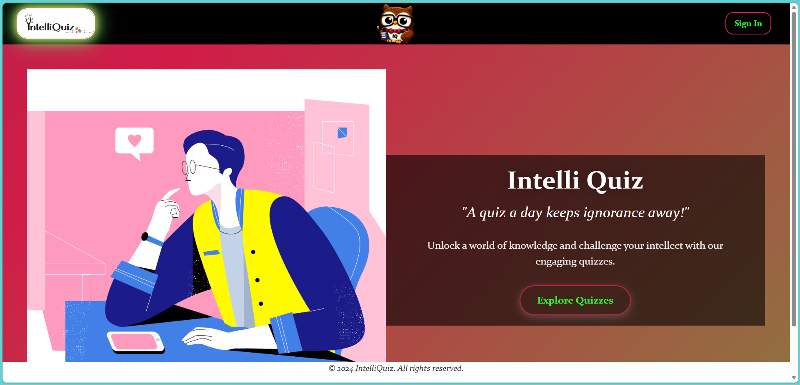
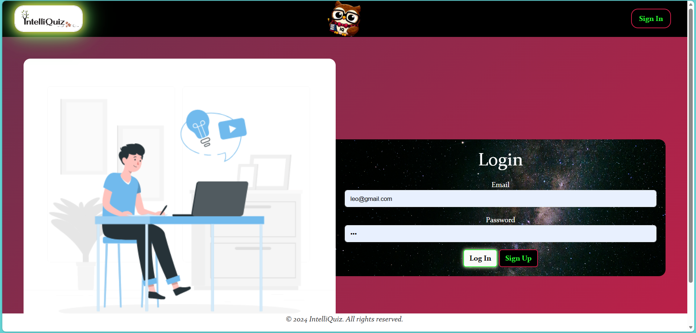
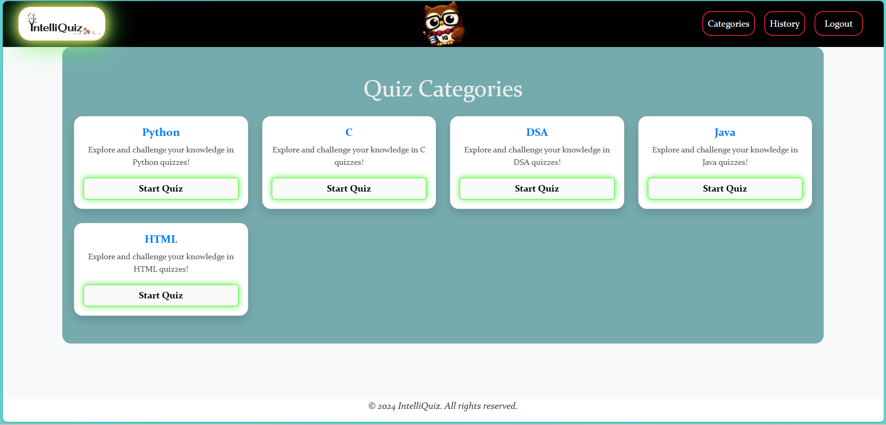
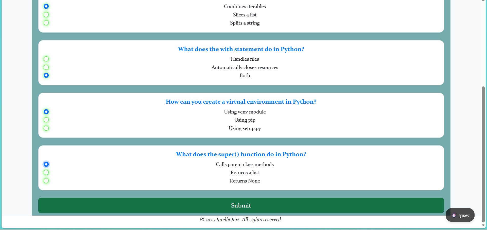
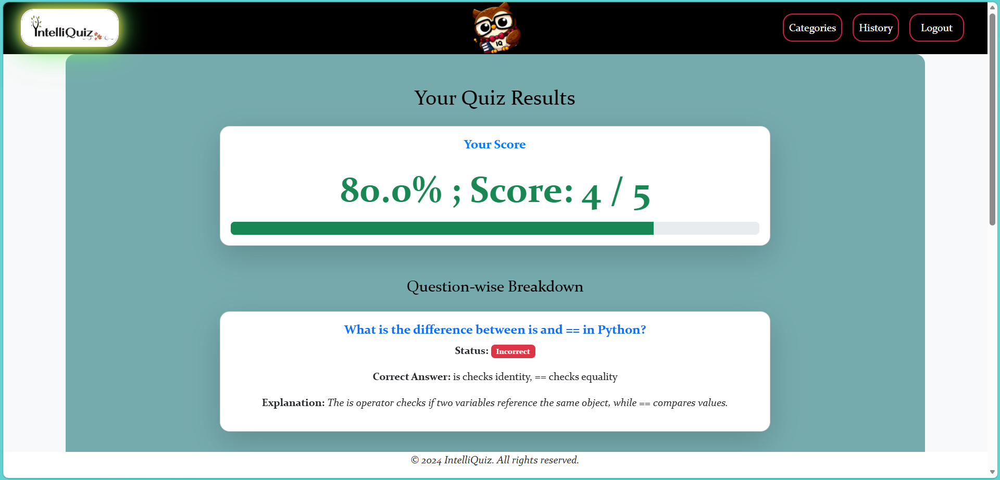
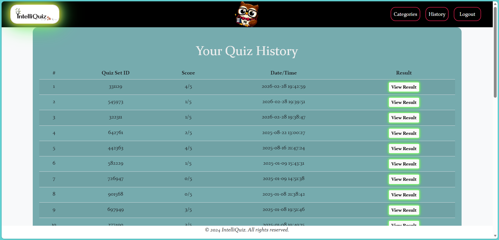

# IntelliQuiz 🧠✨  
*A Smart Quiz Platform for Learning, Not Just Testing*

IntelliQuiz is a full-stack **web-based quiz application** built using **Python and Flask**, designed to help users learn programming and technical concepts through interactive quizzes.

Unlike basic quiz apps, IntelliQuiz focuses on **learning improvement**, not just scoring, by tracking user performance and reinforcing weak areas over time.

---

## 🚀 Key Features

- 🔐 Secure user registration and login system  
- 📚 Topic-based quizzes on programming and technical subjects  
- 📊 Performance tracking with detailed quiz results  
- 🧠 Adaptive learning by revisiting incorrectly answered questions  
- 🛠 Admin dashboard to manage quizzes and questions  
- 📱 Clean and responsive user interface  

---

## 🛠 Tech Stack

- **Backend:** Python, Flask  
- **Frontend:** HTML, CSS  
- **Database:** PostgreSQL  
- **Tools:** PyCharm, Git, GitHub  

---

## 🧠 How IntelliQuiz Works

1. Users sign up and log in securely  
2. Quizzes are selected based on categories  
3. User responses are stored and evaluated  
4. Incorrect answers are analyzed to improve future attempts  
5. Users can view quiz history and performance insights  

---

## ▶️ How to Run Locally

1. Install dependencies  
   ```bash
   pip install -r requirements.txt

2. Run the application

       python app.py

3. Open in browser
    ```
   http://127.0.0.1:5000

---

## 🎯 Learning Outcomes

- Hands-on experience with Flask and backend development

- Understanding of authentication and database modeling

- Experience building real-world full-stack applications

- Improved problem-solving and project structuring skills

---

## 🔮 Future Enhancements

- Timed quizzes and difficulty levels

- Analytics dashboard for deeper insights

- Improved UI using JavaScript frameworks

- Deployment on a cloud platform

---

## 📸 Screenshots

### Home Page


### Login Page


### Quiz Categories


### Quiz Interface


### Results & Feedback


### Quiz History


